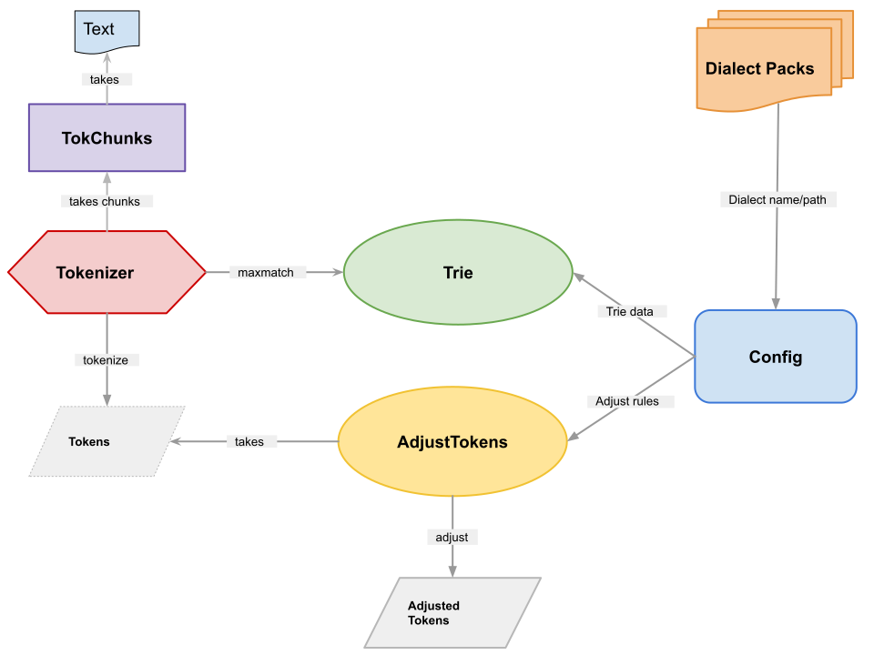

Architecture
============

WordTokenizer architecture
--------------------------

Following is the architecture diagram of the `WordTokenizer <ihttps://github.com/Esukhia/botok/blob/a019ca9a3785b41761cf04b140efeb70181709a7/botok/tokenizers/wordtokenizer.py#L28>`_ class

Tokenization workflow
---------------------

Here is botok tokenization workflow with an examples.

.. code::

    >>> input_string = "ཀུན་་་དགའི་དོན་གྲུབ།"
    >>> from botok import BoSyl, Config, TokChunks, Tokenize, Trie
    >>> config = Config()
    >>> trie = Trie(BoSyl, profile=config.profile, main_data=config.dictionary, custom_data=config.adjustments)
    >>> tok = Tokenize(trie)
    >>> preproc = TokChunks(input_string)
    >>> preproc.serve_syls_to_trie()
    >>> tokens = tok.tokenize(preproc)
    >>>
    >>> print(*tokens, sep=f"{'='*65}\n\n")
    text: "ཀུན་་་དགའི་"
    text_cleaned: "ཀུན་དགའི་"
    text_unaffixed: "ཀུན་དགའ་"
    syls: ["ཀུན", "དགའི"]
    senses: | pos: PROPN, freq: 2923, affixed: True |
    char_types: |CONS|VOW|CONS|TSEK|TSEK|TSEK|CONS|CONS|CONS|VOW|TSEK|
    chunk_type: TEXT
    syls_idx: [[0, 1, 2], [6, 7, 8, 9]]
    syls_start_end: [{'start': 0, 'end': 6}, {'start': 6, 'end': 11}]
    start: 0
    len: 11

    =================================================================

    text: "དོན་གྲུབ"
    text_cleaned: "དོན་གྲུབ་"
    text_unaffixed: "དོན་གྲུབ་"
    syls: ["དོན", "གྲུབ"]
    senses: | pos: PROPN, freq: 1316, affixed: False |
    char_types: |CONS|VOW|CONS|TSEK|CONS|SUB_CONS|VOW|CONS|
    chunk_type: TEXT
    syls_idx: [[0, 1, 2], [4, 5, 6, 7]]
    syls_start_end: [{'start': 0, 'end': 4}, {'start': 4, 'end': 8}]
    start: 11
    len: 8

    =================================================================

    text: "།"
    char_types: |NORMAL_PUNCT|
    chunk_type: PUNCT
    start: 19
    len: 1
    >>>
    >>> from botok import AdjustTokens
    >>>
    >>> adjust_tok = AdjustTokens(main=config.dictionary["rules"], custom=config.adjustments["rules"])
    >>> adjusted_tokens = adjust_tok.adjust(tokens)
    >>> print(*adjusted_tokens, sep=f"{'='*65}\n\n")
    text: "ཀུན་་་དགའི་"
    text_cleaned: "ཀུན་དགའི་"
    text_unaffixed: "ཀུན་དགའ་"
    syls: ["ཀུན", "དགའི"]
    senses: | pos: PROPN, freq: 2923, affixed: True |
    char_types: |CONS|VOW|CONS|TSEK|TSEK|TSEK|CONS|CONS|CONS|VOW|TSEK|
    chunk_type: TEXT
    syls_idx: [[0, 1, 2], [6, 7, 8, 9]]
    syls_start_end: [{'start': 0, 'end': 6}, {'start': 6, 'end': 11}]
    start: 0
    len: 11

    =================================================================

    text: "དོན་གྲུབ"
    text_cleaned: "དོན་གྲུབ་"
    text_unaffixed: "དོན་གྲུབ་"
    syls: ["དོན", "གྲུབ"]
    senses: | pos: PROPN, freq: 1316, affixed: False |
    char_types: |CONS|VOW|CONS|TSEK|CONS|SUB_CONS|VOW|CONS|
    chunk_type: TEXT
    syls_idx: [[0, 1, 2], [4, 5, 6, 7]]
    syls_start_end: [{'start': 0, 'end': 4}, {'start': 4, 'end': 8}]
    start: 11
    len: 8

    =================================================================

    text: "།"
    char_types: |NORMAL_PUNCT|
    chunk_type: PUNCT
    start: 19
    len: 1